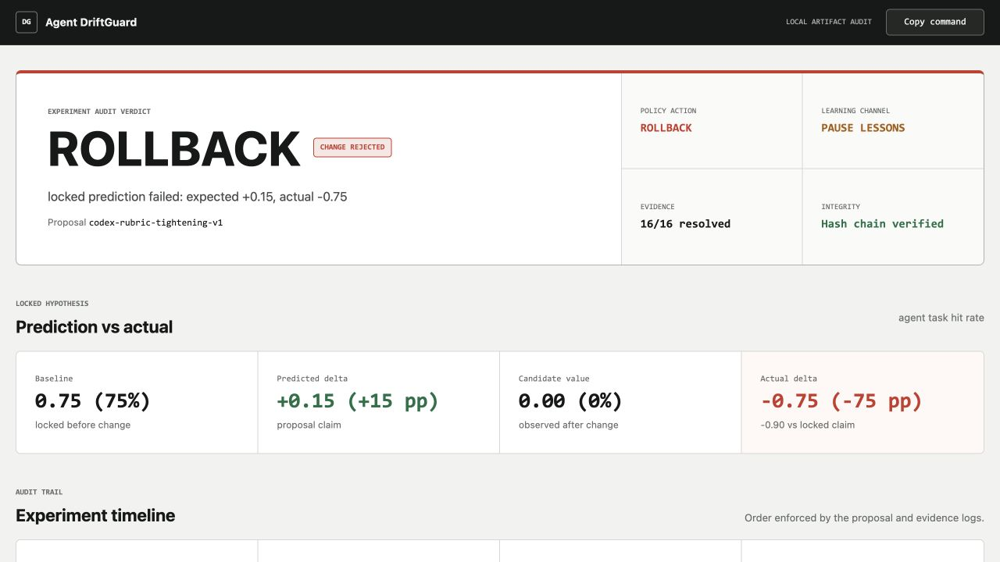

# Agent DriftGuard

[](LICENSE)

[Watch the 2:22 demo video](https://youtu.be/oUA32nraAc8)

[View the OpenAI Build Week submission](https://devpost.com/software/agent-driftguard)

**A flight recorder and rollback gate for agent self-improvement.**

Agent DriftGuard prevents an agent from turning weak feedback into permanent
prompt or configuration changes. Every proposal must lock a falsifiable metric
prediction before candidate results exist. DriftGuard then checks
machine-verifiable outcomes, calibration, health, and anchor drift before it
keeps the change, pauses learning, or restores the last-known-good config.

OpenAI Build Week category: **Developer Tools**.



## Try the Demo

Requirements: Python 3.10+ and a modern desktop browser. There are no package,
API-key, account, network, or build-step requirements.

```bash
python3 scripts/run_demo.py
```

Then open `web/index.html`. The default scenario demonstrates a failed agent
rubric change and a deterministic rollback. The generated dashboard is already
included, so judges can inspect it before running the command.

DriftGuard can also accept a change when the evidence supports it:

```bash
python3 scripts/run_demo.py --scenario keep
```

Run the default command again to restore the rollback dashboard used in the
demo video.

## What It Proves

The synthetic experiment is ordered like a real rollout:

1. Establish a machine-verifiable baseline (`3/4 = 0.75`).
2. Lock a proposal predicting a `+0.15` hit-rate improvement.
3. Apply it and observe a fresh candidate batch (`0/4 = 0.00`).
4. Verify the prediction, detect health and anchor drift, block lesson
   injection, and restore the previous config.

The proposal is written after baseline reviews and before candidate
registrations. Both JSONL logs use a sequence-numbered SHA-256 hash chain, so
editing, deleting, or reordering evidence is detected. Integrity failure makes
the decision engine pause instead of trusting damaged evidence.

For reproducible judging, the demo runner replaces its generated artifacts at
the start of each invocation. Within an experiment, every prediction, review,
proposal, apply, and verify operation is append-only.

Generated evidence:

- `artifacts/demo-ledger.jsonl`: hash-chained predictions and verdicts
- `artifacts/proposal-log.jsonl`: propose/apply/verify lifecycle
- `artifacts/drift-report.json`: metrics, gates, integrity, and final action
- `artifacts/decision.md`: human-readable deterministic decision
- `artifacts/dashboard-data.js`: local data bundle for the zero-build UI

All demo data is synthetic and intentionally small enough to inspect by hand.

## Architecture

```text
fixtures/                 Synthetic baseline and candidate outcomes
scripts/run_demo.py       Experiment orchestration and report generation
src/feedback_kit/         Self-contained feedback-loop kernel
web/                      Zero-dependency audit dashboard
artifacts/                Inspectable generated evidence
tests/                    Kernel, integrity, and end-to-end checks
```

The core is a deterministic Python standard-library package. Model output can
suggest a proposal, but it cannot decide whether its own proposal passes. Soft
LLM verdicts are recorded with capped confidence and excluded from calibration
and lesson distillation.

## Verify It

```bash
python3 tests/test_feedback_kit.py
python3 tests/test_demo.py
```

The end-to-end test verifies both rollback and keep paths, the temporal order
of baseline/proposal/candidate events, and both evidence hash chains.

Supported platforms: macOS, Linux, and Windows with Python 3.10+. Event writes
are lock-protected on Unix; the local demo is single-writer on Windows.

## Built With Codex and GPT-5.6

Codex was used during Build Week to audit the pre-existing kernel, find a
critical chronology flaw in the first demo, design the product boundary,
implement the self-contained experiment runner and tamper-evident event log,
and build the regression tests. A GPT-5.6 Codex worker implemented the audit
dashboard from a field-level data contract; the main Codex task integrated and
verified it. The human product decisions were to keep the scope local and
deterministic, use synthetic evidence, and optimize the three-minute story
around one inspectable rollback.

The proposal fixture itself is synthetic; the project does not pretend it is a
captured model response. DriftGuard's value is the deterministic boundary
around model-suggested changes.

See `docs/build-provenance.md` for the explicit pre-Build-Week/new-work split.
The required `/feedback` Codex Session ID was generated from the main project
task and entered in the Devpost submission form.

## Build Week Scope

The general `feedback-kit` kernel existed before the submission period. It is
bundled under `src/feedback_kit/` only so this repository is independently
runnable; pre-existing work is not presented as Build Week output. The new
submission-period work is the DriftGuard product: chronological experiment
orchestration, hash-chained evidence and fail-closed integrity gating, dual
rollback/keep scenarios, the audit dashboard, end-to-end tests, and submission
materials.
